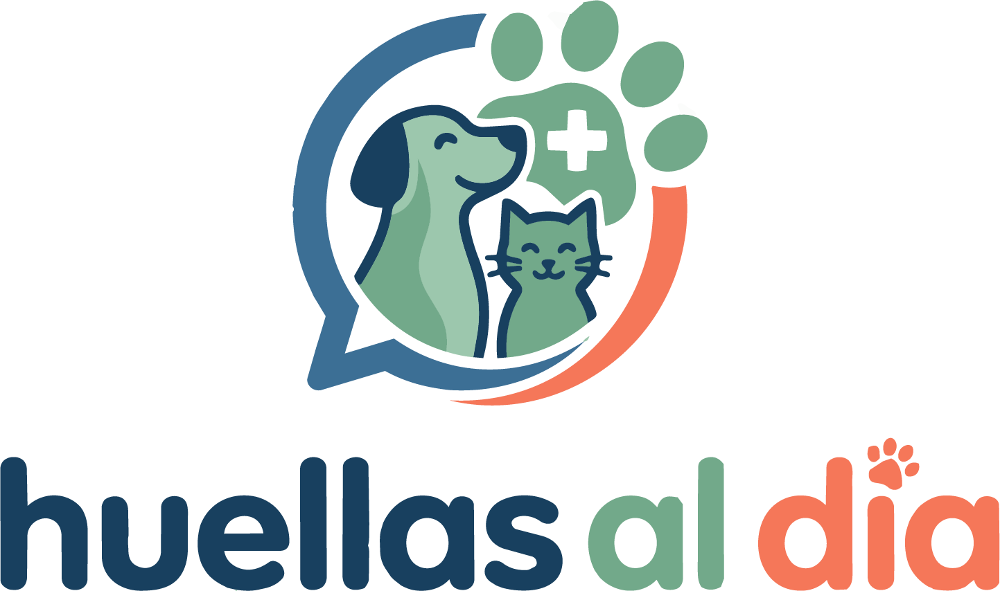
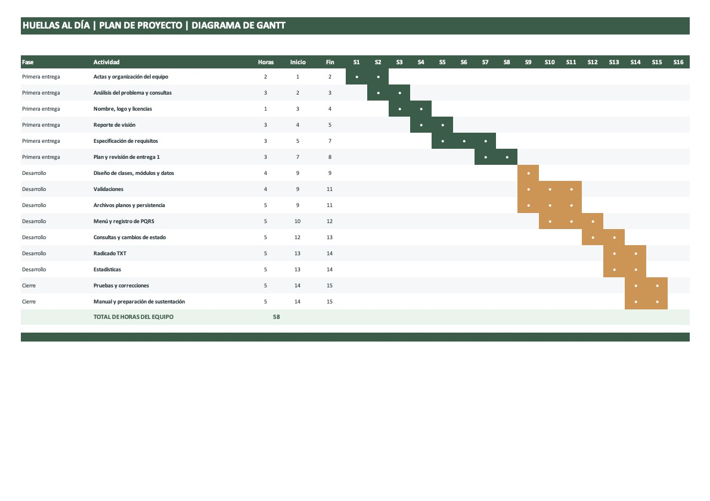

# Huellas al día

## Integrantes del Equipo

### Alex Aiverson Palacios Mosquera
**Programa Académico:** Ingeniería Industrial
**Descripción, Habilidades y Fortalezas:** 
Fundamentos de Python, habilidades medias en diseño gráfico, edición de imágenes digitales, organización, análisis de problemas y cumplimiento de fechas.
**Aporte al proyecto:** 
Creación del nombre del proyecto y el logo, apoyar en la definición de requisitos, la documentación y la creación del código.

### Iván Ricardo Naranjo Bustamante
**Programa Académico:** Ingeniería Industrial
**Descripción, Habilidades y Fortalezas:** 
Alta capacidad de adaptación a cualquier contexto o dinámica de trabajo, junto con un nivel intermedio de inglés. Destaca por su versatilidad y facilidad para integrarse a diferentes entornos.
**Aporte al proyecto:** 
Participación equitativa e integral en todas las fases del proyecto, brindando apoyo transversal tanto en la estructuración documental como en el desarrollo técnico, ajustándose rápidamente a los requerimientos puntuales del equipo.

## Descripción

### Logo 
 

### Descripción 
Este proyecto consiste en el desarrollo de un sistema de información por consola diseñado para centralizar y administrar las Peticiones, Quejas, Reclamos y Sugerencias (PQRS) relacionadas con la atención veterinaria de perros y gatos. El software automatiza la asignación de radicados únicos, controla los tiempos máximos de respuesta de 30 días y genera estadísticas clave, optimizando la gestión documental y el servicio prestado por la organización.

## Licencia del software 

1. **Licencia para el Código Fuente (MIT):** Todo el código ejecutable alojado en la carpeta `src/` se distribuyen bajo la Licencia MIT, permitiendo su libre uso, modificación y distribución.
2. **Licencia para Documentación y Recursos Gráficos (Creative Commons):** Siguiendo las directrices del curso, todos los documentos, manuales, el logo y los textos alojados en `docs/` e `images/` están registrados bajo la licencia **CC BY-NC 4.0** (Atribución-NoComercial 4.0 Internacional).

## Reporte de visión

### Problema que se busca resolver

Huellas al dia recibe PQRS por medios como redes sociales, correo electrónico,
teléfono y atención presencial. Cuando estas solicitudes se gestionan
manualmente, resulta más difícil mantener la información organizada,
consultar el estado de cada caso y verificar cuáles se acercan a su
fecha máxima de respuesta.

Huellas al Día busca reunir esas tareas en un programa de consola que
permita registrar y consultar la información de manera estructurada.

###  Objetivo general

Desarrollar un programa de consola en Python que permita a Huellas al dia
registrar, consultar y gestionar las PQRS relacionadas con la atención
de perros y gatos, utilizando archivos de texto (.txt) para conservar la
información y generar reportes de apoyo a la gestión.

### Objetivos específicos

- Registrar los datos del solicitante y la información de cada PQRS.
- Clasificar las solicitudes como petición, queja, reclamo o sugerencia.
- Asignar a cada registro un identificador consecutivo dentro de su
  tipo de solicitud.
- Almacenar cada tipo de PQRS en un archivo plano independiente.
- Consultar las solicitudes registradas y su estado.
- Permitir el avance del estado desde «Registrada» hasta «Solucionada»,
  pasando por «En proceso».
- Calcular y mostrar la fecha máxima de respuesta establecida para
  cada solicitud.
- Generar un comprobante de radicación en formato TXT.
- Presentar estadísticas que ayuden a conocer el volumen y la gestión
  de las solicitudes.

### Beneficios esperados

- Organizar las PQRS recibidas por diferentes canales.
- Facilitar la consulta de solicitudes y de su estado.
- Disminuir errores asociados con la asignación manual de consecutivos.
- Apoyar el seguimiento de los plazos de respuesta.
- Contar con comprobantes de radicación uniformes.
- Obtener estadísticas útiles para revisar la gestión de MEPEGA.

## Especificación de requisitos

### Requisitos funcionales

- Mostrar un menú principal con opciones para registrar, consultar, actualizar estados, ver estadísticas y salir. El usuario puede seleccionar cada opción desde la consola. 
- Registrar una PQRS con datos del solicitante, información de la solicitud y datos relacionados. El registro se guarda únicamente si supera las validaciones.
- Permitir seleccionar el tipo de solicitud: Petición, Queja, Reclamo o Sugerencia. El sistema rechaza valores distintos de los permitidos.
- Asignar un ID entero consecutivo a cada PQRS, comenzando en 1 y con una secuencia independiente por tipo. Una nueva petición recibe el ID siguiente de `Peticion.txt`, sin depender de los IDs de `Queja.txt`. 
- Guardar cada tipo de PQRS en su archivo plano correspondiente. | Las peticiones se guardan solo en `Peticion.txt`; las quejas, en `Queja.txt`; los reclamos, en `Reclamo.txt`; y las sugerencias, en `Sugerencia.txt`. 
- Registrar automáticamente el estado inicial `Registrada`. Toda PQRS recién creada tiene ese estado.
- Calcular la fecha máxima de respuesta sumando 30 días calendario a la fecha de registro. | La fecha calculada queda asociada al registro y aparece en el radicado.
- Consultar las PQRS registradas y mostrar su información y estado actual. | El usuario puede identificar una PQRS mediante su tipo y su ID.
- Permitir el cambio de estado `Registrada` → `En proceso` → `Solucionada`. El sistema acepta el siguiente estado permitido y rechaza saltos o retrocesos.
- Generar un comprobante de radicación en un archivo TXT. El archivo contiene los datos exigidos y puede abrirse como texto.
- Mostrar una PQRS consultada con el mismo formato básico del radicado. La consulta refleja el estado actual del registro.
- Calcular el promedio de días de respuesta de las PQRS solucionadas. El reporte muestra un resultado entero cuando existen casos con fecha de solución registrada. 
- Presentar cinco estadísticas adicionales sobre los registros. Cada estadística muestra resultados calculados a partir de los archivos planos.
- Permitir salir del programa desde el menú principal. La ejecución termina sin modificar los registros existentes.
- Generar el radicado como archivo de texto TXT. 
- Delimitar el comprobante mediante un marco de caracteres ASCII, como `+`, `-` y `|`. 
- Hacer que cada línea del comprobante tenga exactamente 120 caracteres. 
- Centrar y alinear las secciones principales. 
- Mostrar el nombre del sistema y el título del comprobante. 
- Mostrar tipo de solicitud, ID, fecha y hora de radicación, estado y fecha máxima de respuesta. 
- Mostrar nombre, documento, teléfono, correo y dirección del solicitante. 
- Mostrar canal de recepción, tipo de mascota, campus y asunto. 
- No incluir la descripción detallada de la solicitud. 
- Mostrar `N/A` cuando la dirección no se haya registrado. 

### Requisitos no funcionales

- El menú y los mensajes deben ser claros para el administrador. 
- Los registros deben conservarse al cerrar y volver a abrir el programa.
- Guardar una PQRS nueva no debe borrar ni sobrescribir registros anteriores. 
- Los cuatro archivos planos deben manejar la misma estructura. Comparar los campos almacenados en cada archivo. 
- Las validaciones, la lectura y escritura de archivos, y los reportes deben separarse en módulos.
- El programa debe ejecutarse con Python 3 en un entorno que cumpla sus dependencias.
- El código debe estar en `src/`, la documentación en `docs/`, las imágenes en `images/` y los archivos en `data/`. 
- Cada línea generada en un radicado debe tener 120 caracteres.

## Plan de proyecto

###  Actividades y productos

- Reunión inicial y elaboración de las tres actas
- Definición del nombre, logo y licencias 
- Elaboración del reporte de visión 
- Especificación de requisitos 
- Elaboración y revisión del plan de proyecto 
- Diseño de clases, módulos y archivos planos 
- Implementación de validaciones 
- Implementación del almacenamiento que son Módulo `archivos.py` y archivos TXT de datos
- Implementación del menú y registro de PQRS 
- Implementación de consulta y cambio de estado 
- Generación del comprobante de radicación 
- Implementación de estadísticas 
- Pruebas y corrección de errores 
- Manual, revisión final y preparación de la sustentación 
 **El total de horas del equipo son 60** 

### Diagrama de Gantt

El siguiente diagrama muestra las actividades previstas para las
16 semanas académicas del proyecto.

### Presupuesto en tiempo de formación

Para el desarrollo de este software, nuestro equipo, compuesto por 2 integrantes, ha proyectado una inversión total de 58 horas de trabajo. 

**Cálculo de la remuneración:**
**Base de liquidación:** 1 Salario Mínimo Legal Vigente (SMLV) correspondiente a práctica profesional.
**Jornada mensual de referencia:** 240 horas.
**Valor por hora invertida:** Al dividir 1 SMLV entre las 240 horas mensuales, se obtiene que cada hora de desarrollo equivale aproximadamente al 0.417% de 1 SMLV.
**Costo Total del Proyecto:** Al multiplicar el valor por hora por las 58 horas totales invertidas por el equipo, el presupuesto del proyecto equivale a una remuneración en tiempo de formación del 24.17% de 1 SMLV.

<a href="https://github.com/Aiver7/ProyectoFinal">Huellas al dia</a> © 2026 por<a href="https://example.com"> Alex Aiverson Palacios Mosquera e Iván Ricardo Naranjo Bustamante  </a> tiene licencia<a href="https://creativecommons.org/licenses/by-nc-sa/4.0/"> CC BY-NC-SA 4.0</a>
